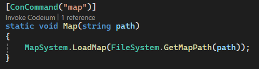
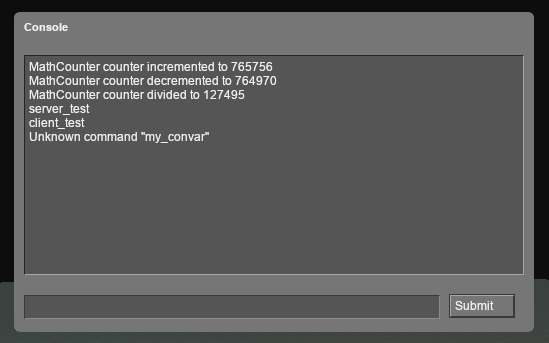

# April 3rd Update
## Developer Console API
The Developer Console now supports *most* things Source Engine's does. You can debug using `Msg`, `Error`, and `Warning`, create triggerable Console Commands with the `[ConCommand]` attribute, and define changable Console Variables with the `[ConVar]` attribute. There's still a few Console Variable Flags that aren't implemented yet but this system is pretty much ready for Input Binding by update.

## VistaGUI Pre-Processor
Having to include the proper `.js` file for every custom Vista Element you wanted to use was a huge pain. To address this, VistaGUI files undergo an initial "Pre-Processing" stage where predefined "rules" are applied to their code, such as automatically adding the necessary Element `.js` files. Now you can just use Vista Elements like any normal HTML Element.

## VistaGUI Legacy (VGUI) Theme
VistaGUI looks great, but I'd still like new GUIs to optionally mantain the iconic VGUI look to them so original Source GUIs can be perfectly recreated in Vista. For this purpose, I created the `Legacy` theme, which, when used in combination with a `<vista-panel>` Element can pretty much perfectly replicate the classic look of Source Engine Panels.

