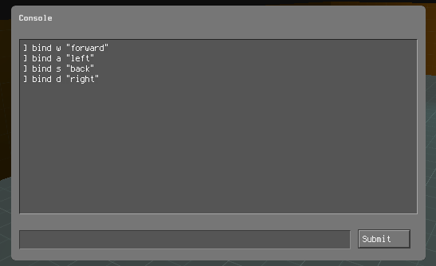
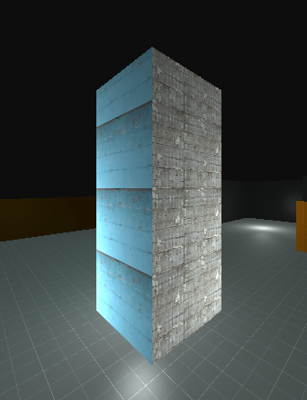
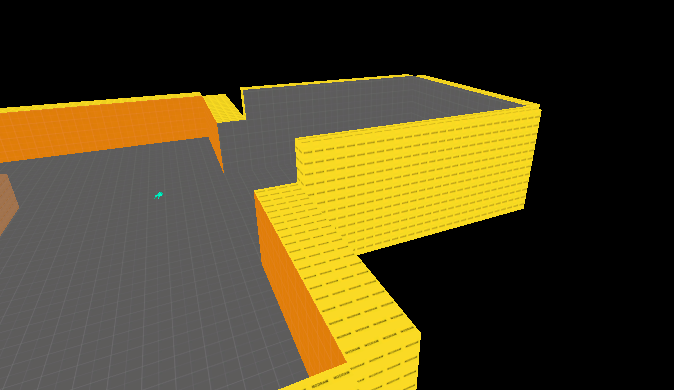
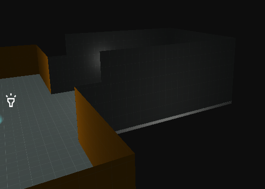

# April 5th Update
## Input Binding
You can now properly bind keys to actions and run C# code when an action is pressed or unpressed. Binds are automatically saved to the config (making them persist between games) and can be set/unset through the Developer Console, just like in Source.

Input can still processed through the traditional `Input.GetKeyDown(keyname)` method, but the new actions system requires minimal setup in projects and works better in pretty much every situation.

## Brush Geometry Changes
Brushes now construct themselves a bit differently: each Side functions as it's own Mesh Entity instead of the entire map being one big Mesh Entity. Along with this change comes a few big features like side-independant Materials.

Every Brush can now have a unique Material on every Side, restoring the original behaviour from before before the engine swap. Additionally, there's also now some Tool materials being introduced.

Nodraw does it's job and soon enough will be culling faces behind it too.

## Brush Entities
Brush Entity support is almost ready. Entities have been reorganized into `BaseEntity` and `PointEntity` classes, with a fully functional `BrushEntity` hopefully getting added within the next two updates.

## Roadmap
It's still a bit early to be commiting to any dates, but I can share some facts about the state of the Engine.

**Brushes are around 70% feature complete** with there only being a few remaining features like Tool textures and moving to proper Plane-Based CSG calculating left until they're perfectly usable.

**20 Entities have been ported** and are available for use already.

**Map Logic is almost complete**, all that's left is porting more Entities and adding Delays.

**Real Time Lighting is almost complete** with a VRAD-esque Baked lighting solution coming soon.

**FGD Generation** is in the conceptual stage and will be worked on once I can figure out how to make it all integrate easily with an original Hammer install.

All that to say, progress has been made insanely fast. Once all these features are wrapped up, the next steps will be porting Portal 2 Entities, refactoring and polishing it all and then the Mod can resume development alongside the Engine. At some point, I'll put together some tech demos and showcases to show any interested Developers. Hopefully, that'll be enough to kickstart actual Mod production.

