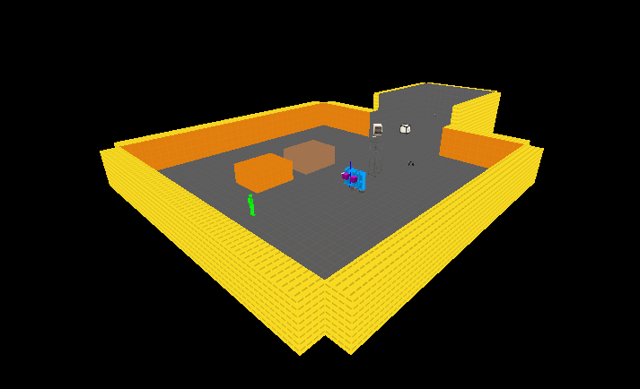
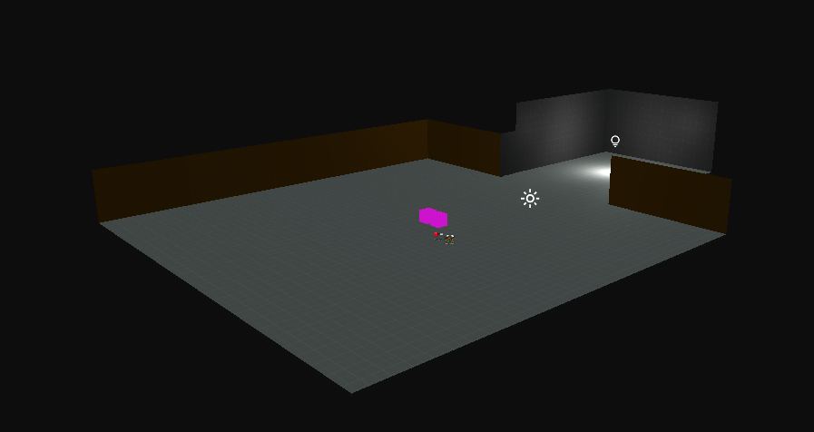
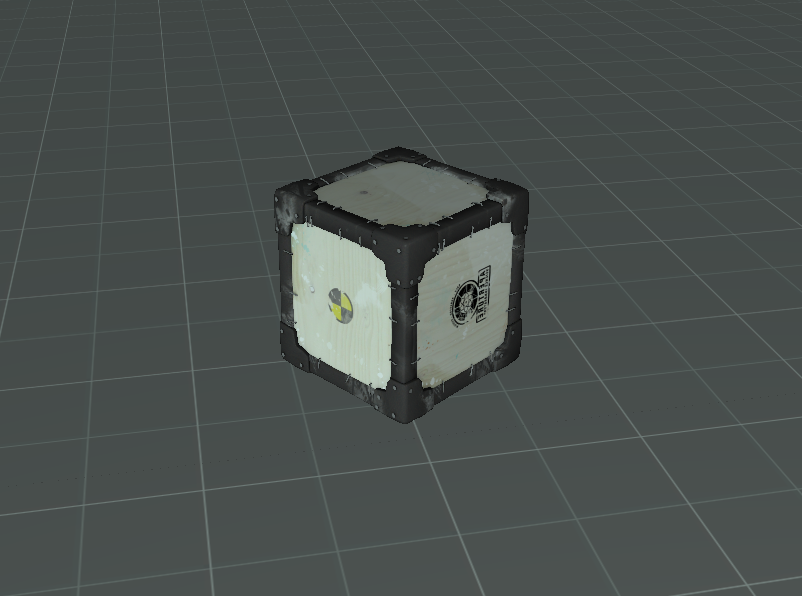

# April 12th Update
## Physics
A Proper Physics system has been implemented into the Engine, you can give any Model Entity physics with unique properties like mass, collision settings, friction, etc. Along with this, Raycasting is now supported using Physics Body colliders. While complex interactions from Source aren't fully there yet (hinges, joints, ropes, etc) they're on the way.

It uses [Bullet Physics](https://en.wikipedia.org/wiki/Bullet_(software)) right now, but the Physics System was designed to support virtually infinite APIs. The plan is to ship with Bullet, Jolt and maybe one other.

## Culling
Render Passes now have a Flag to Cull Back-Faces, Front-Faces, or both. The Opaque pass uses Back-Face culling by default to improve perfomance and also allow the `NODRAW` Texture to properly cull, just like it does in Source.

## Shader Texture Uniforms
You can now set a Shader's `Sampler2D` parameter to a Texture directly through code, as expected. This used to be completely hard-coded with the only way to work with a Texture on a mesh being through accessing `Material.Texture`. This old method has been replaced by the much cleaner system where you simply update the Shader parameter with `Material.Shader.SetParameter("Sampler2DParameterName", DesiredTexture);`

## MDL Loading
Saving the best for last, Portal 2 `.MDL` Models can now load natively into the Engine. Props placed in Hammer appear the exact same in game, with no texture or model conversion, and no extra processing required. What you see in Hammer is what you get in the Engine.

Right now, all the major generic 3D Model formats are supported (OBJ, FBX, etc). However, MDLs hold a lot more data then just Mesh information and things can get confusing if *all* formats are usable when some hold more information than others. Because of this, full generic format support will likely get put on the back-burner for now (but it's still a consideration!).

