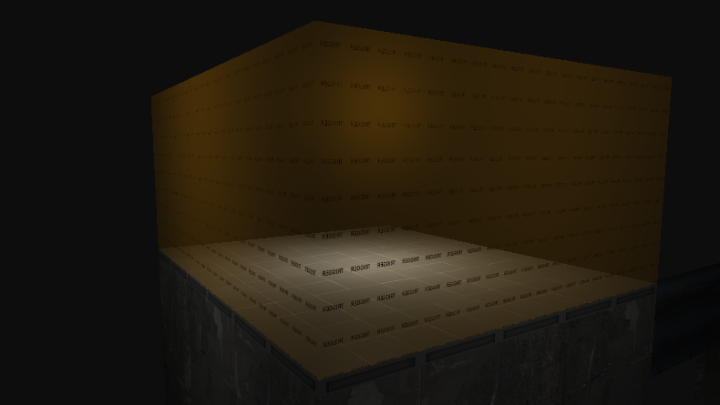
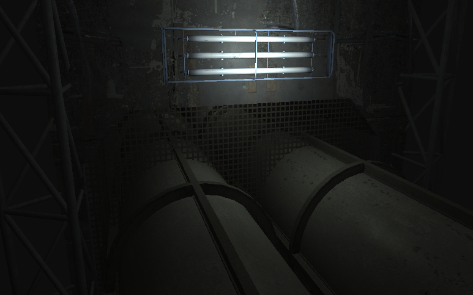
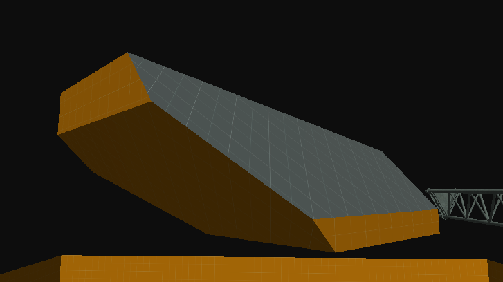

# April 17th Update
## Physics Changes
A LOT of things have changed with the Physics system. You can now detect Physics Body collisions with events like `OnCollisionStart`, constrain rotation axes, set bodies to Dynamic, Kinematic or Static modes, and more. It's too much to cover in detail, but physics interactions should feel much better now and much closer to Source.

## Brush Entities
Support for Brush Entities has been added, meaning a lot of critical Entities can finally be ported. Some initial porting work has already been done, with `trigger_once` and `trigger_multiple` now being fully usable.

## Character Controller
There's now a true physics based FPS Character Controller. It can walk, jump, push physics objects and properly collide with the world. It's not exact to Source just yet, but features like airstrafing, bunnyhopping, built-in interacting and all the other beloved mechanics will be there soon.

## Transparency
There's now an actual Transparency Render Pass. Objects with the correct VMT flags will render with proper alpha blending, showing the objects behind them.

## Brush CSG
Brush sides are no longer limited to just simple quads. Each side uses the same [plane construction method](https://developer.valvesoftware.com/wiki/VMF_%28Valve_Map_Format%29#Planes) as Source, allowing advanced Brush manipulation to be done in Hammer with tools like the Clipping tool.

## Input Presses
You no longer have to manually managle single-press input logic. The Input class now has `GetPressed()`, which returns true on the first frame the specified action is pressed.